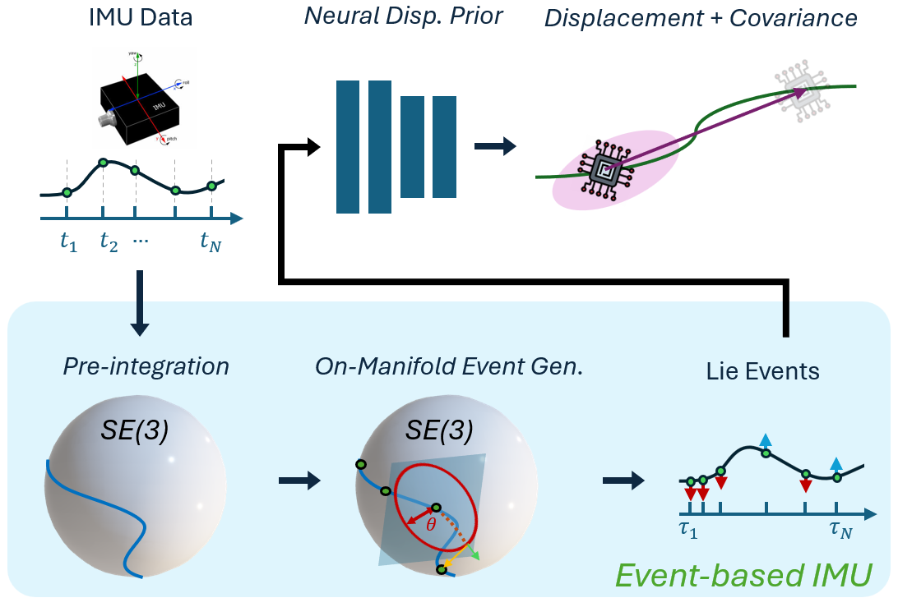

# Neural Inertial Odometry from Lie Events (RSS 2025)


**Figure: Neural Inerial Odometry from Lie Events. We train Neural Displacement Priors (NDPs), which enable low-drift inertial odometry, with Lie Events derived from acceleration $\boldsymbol{a}(t_i)$ and angular rate $\boldsymbol{\omega}(t_i)$ measurements from an Inertial Measurement Unit (IMU). These events enhance the robustness of NDPs due to their favorable properties under varying sampling rates and trajectory profiles. To generate these events, we produce pre-integrations $\mathbf{x}(t)$ which reside in the special Euclidean group $SE(3)$ and then perform level-crossing on this signal which prompts the generalization of level-crossing and event polarities (red and blue arrows) to higher dimensional manifolds..**


This repository contains code that implements the event generation on $SE(3)$ manifold described in Jayanth et al. RSS'25, and the used dataset.
<!-- **Paper**: [ICLR 2025](https://openreview.net/forum?id=C8jXEugWkq), [arXiv](https://arxiv.org/abs/2408.06321)  -->

Please cite the following paper if you use the code or paper:  

Royina Karegoudra Jayanth, Yinshuang Xu, Evangelos Chatzipantazis, Kostas Daniilidis, Daniel Gehrig,"Neural Inertial Odometry from Lie Events", RSS, 2025.

<!-- ```bibtex
@InProceedings{Jayanth25iclr,
   title      = {Eq{NIO}: Subequivariant Neural Inertial Odometry},
   author     = {Royina Karegoudra Jayanth and Yinshuang Xu and Daniel Gehrig and Ziyun Wang and Evangelos Chatzipantazis and Kostas Daniilidis},
   booktitle  = {The Thirteenth International Conference on Learning Representations},
   year       = {2025},
   url        = {https://openreview.net/forum?id=C8jXEugWkq}
}
``` -->

---
## Cloning the repository
Clone the repo
```bash
git clone https://github.com/RoyinaJayanth/NIO_Lie_Events.git
```

or 

```bash
git clone git@github.com:RoyinaJayanth/NIO_Lie_Events.git --recursive
```

---
## Installation
All dependencies can be installed using conda via
```bash
conda env create -f environment.yaml
```
Then the virtual environment is accessible with:
```bash
conda activate nio_lie_ev
```

Next commands should be run from this environment.

---

## Event Generation on Manifold

We provide the math utils (`General/utils_tlio`) needed and event generation functions (`General/Event_generation.py`) that can be directly called for $SE(3)$, $SO(3)$ and $R(3)$ in the General folder in this repository.

---

## TLIO Architecture

original work: [website](https://cathias.github.io/TLIO/)

We apply our framework to this filter-based inertial odometry architecture.

### Data
1. TLIO Dataset: [Download Here](https://drive.google.com/file/d/10Bc6R-s0ZLy9OEK_1mfpmtDg3jIu8X6g/view?usp=share_link) or with the following command (with the conda env activated) at the root of the repo:
```bash
gdown 14YKW7PsozjHo_EdxivKvumsQB7JMw1eg
mkdir -p local_data/ # or ln -s /path/to/data_drive/ local_data/
unzip golden-new-format-cc-by-nc-with-imus-v1.5.zip -d local_data/
rm golden-new-format-cc-by-nc-with-imus-v1.5.zip
```
https://drive.google.com/file/d/14YKW7PsozjHo_EdxivKvumsQB7JMw1eg/view?usp=share_link
The dataset tree structure looks like this.
Assume for the examples we have extracted the data under root directory `local_data/tlio_golden`:
```
local_data/tlio_golden
├── 1008221029329889
│   ├── calibration.json
│   ├── imu0_resampled_description.json
│   ├── imu0_resampled.npy
│   └── imu_samples_0.csv
├── 1014753008676428
│   ├── calibration.json
│   ├── imu0_resampled_description.json
│   ├── imu0_resampled.npy
│   └── imu_samples_0.csv
...
├── test_list.txt
├── train_list.txt
└── val_list.txt
```

`imu0_resampled.npy` contains calibrated IMU data and processed VIO ground truth data.
`imu0_resampled_description.json` describes what the different columns in the data are.
The test sequences contain `imu_samples_0.csv` which is the raw IMU data for running the filter. 
`calibration.json` contains the offline calibration. 
Attitude filter data is not included with the release.


2. Aria Dataset: [Download Here](https://www.projectaria.com/datasets/aea/)

### Pretrained Models
1. TLIO + events ( $SE(3)$ + polarity): [Download Here](https://drive.google.com/file/d/1xQ68eY4Yajx0wzydYKHF5ulHlzW0EaGx/view?usp=drive_link)
2. TLIO + events ( $SE(3)$ ): [Download Here](https://drive.google.com/file/d/1QrCoY2gwEdDQLbBbrVBIqYfVxf-frTxf/view?usp=drive_link)
3. TLIO + events ( $SO(3)$ and $R(3)$ ): [Download Here](https://drive.google.com/file/d/17354mx-p3slCmYOpg0xWMSw9BqUQG-pN/view?usp=drive_link)
4. TLIO + events ( $R(3)$ ): [Download Here](https://drive.google.com/file/d/1QObhYH31pY9Iq731oWozjMX9wRpt8Fzx/view?usp=drive_link)


### Training and Testing 

(Optional) Download the dataset and the pre-trained models. 
To train and test NN run ```TLIO-master/src/main_net.py``` with mode argument. Please refer to the source code for the full list of command line arguments. 

```bash
python3 TLIO-master/src/main_net.py --mode train \
                                    --root_dir local_data/tlio_golden \
                                    --out_dir models/tlio_ev_se3p \
                                    --batch_size 1024 \
                                    --epochs 50 \
                                    --arch resnet \
                                    --input_dim 12 \
                                    --do_bias_shift \
                                    --perturb_gravity \
                                    --yaw_augmentation \
                                    --event_based_input \
                                    --contrast_threshold 0.01 \
                                    --add_vel_perturb \
                                    --add_vel_perturb_range 0.5 \
                                    --se3_events \
                                    -- polarity_input \
                                    --polarity_noise_range 0.5 
```
For testing run the following
```bash
python3 TLIO-master/src/main_net.py --mode test \
                                    --root_dir local_data/tlio_golden \
                                    --out_dir models/tlio_ev_se3p/nn_test \
                                    --model_path models/tlio_ev_se3p/checkpoint_best.pt\
                                    --arch resnet \
                                    --test_list test_list.txt\
                                    --input_dim 12 \
                                    --event_based_input \
                                    --contrast_threshold 0.01 \
                                    --se3_events \
                                    --polarity_input

```
### Running the EKF
To run the EKF run ```TLIO-master/src/main_filter.py``` . Please refer to the source code for the full list of command line arguments. 
    
```bash
python3 TLIO-master/src/main_filter.py --root_dir local_data/tlio_golden \
                                       --out_dir models/tlio_ev_se3p/ekf_test \
                                       --model_path models/tlio_ev_se3p/checkpoint_best.pt \
                                       --model_param_path models/tlio_ev_se3p/parameters.json \
                                       --event_based_input \
                                       --polarity_input \
                                       --contrast_threshold 0.01 \
                                       --se3_events
```
### Calculating metrics
To generate the NN metrics run ```src/analysis/NN_output_metrics.py``` 

```bash
python3 TLIO/src/analysis/NN_output_metrics.py --files models/tlio_ev_se3p/nn_test\
                                       --output_file_name tlio_nn_results 
```
and for EKF metrics run ```src/analysis/EKF_output_metrics.py```

```bash
python3 TLIO/src/analysis/EKF_output_metrics.py --files models/tlio_ev_se3p/ekf_output \
                                       --ground_truth_path local_data/tlio_golden \
                                       --output_file_name tlio_ekf_results 
```
---

## RONIN Architecture

Original work: [website](http://ronin.cs.sfu.ca/)

We show the benefits of our framework applied to this end-to-end Neural Network architecture.

### Data
1. RoNIN Dataset: [Download Here](https://ronin.cs.sfu.ca/) or [here](https://www.frdr-dfdr.ca/repo/dataset/816d1e8c-1fc3-47ff-b8ea-a36ff51d682a)
\* Note: Only 50\% of the Dataset has been made publicly available. In this work we train on only 50\% of the data.

2. RIDI Dataset: [Download Here](https://www.dropbox.com/s/9zzaj3h3u4bta23/ridi_data_publish_v2.zip?dl=0)

3. OXOID Dataset: [Download Here](http://deepio.cs.ox.ac.uk/)

### Pretrained Models
1. RoNIN + Events ( $SE(3)$ + polarity): [Download Here](https://drive.google.com/file/d/1r9yHBxNoL_oPpqjZaXlJbcybjFJt4GOC/view?usp=drive_link)

### Training and Testing

Download the dataset and the pre-trained models. 
To train/test **RoNIN ResNet** model run ```source/ronin_resnet.py``` with mode argument. Please refer to the source code for the full list of command line arguments. 

```bash
python3 ronin_resnet.py --mode train \
                        --train_list lists/list_train.txt \
                        --val_list lists/list_val.txt \
                        --step_size 10 \
                        --root_dir ronin_data/all_data \
                        --cache_path ev_data/ronin_ev_se3p \
                        --out_dir ev_output/ronin_ev_se3p \
                        --arch resnet18 \
                        --contrast_threshold 0.1 \
                        --add_vel_perturb_range 0.5 \
                        --polarity_noise_range 0.5 \
                        --batch_size 128
                        --epochs 120
```
and for testing run

```bash
python3 ronin_resnet.py --mode test \
                        --test_list lists/list_test_unseen.txt \
                        --root_dir ronin_data/all_data \
                        --out_dir ev_output/ronin_ev_se3p/test_ronin_unseen \
                        --arch resnet18
                        --model_path ev_output/ronin_ev_se3p/checkpoints/checkpoint_last.pt \
                        --contrast_threshold 0.1
```